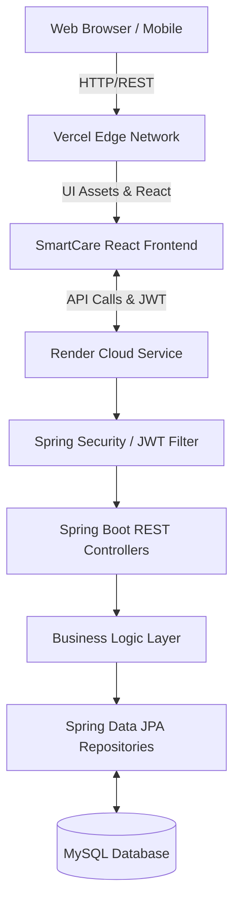

<div align="center">
  
  <h1 align="center">SmartCare</h1>
  <h3 align="center">Advanced Healthcare Appointment & Queue Management System</h3>

  <p align="center">
    A premium, full-stack digital solution engineered to eliminate physical waiting lobbies and streamline medical operations for clinics and hospitals.
  </p>

  <p align="center">
    <a href="https://smartcare-healthcare-appointment-an.vercel.app/" target="_blank">
      
    </a>
  </p>

  <p align="center">
    
    
    
    
    
    
    
    
  </p>
</div>

---

## 📖 Project Overview
**SmartCare** is an enterprise-grade web application designed to revolutionize the outpatient experience. By completely digitizing the appointment booking process and introducing a **Live SC-Coded Token Queue**, it eliminates the traditional friction of hospital waiting rooms. The platform provides dedicated, highly secure portals for Patients, Clinical Staff, and Administrators.

## ❗ Problem Statement
Traditional healthcare facilities suffer from immense operational inefficiencies:
* **Overcrowded Waiting Rooms:** Patients wait hours beyond their scheduled times due to opaque queuing systems.
* **Lack of Real-Time Tracking:** Outpatients have no visibility into how far away their turn is, forcing them to remain physically present.
* **Manual Administrative Overhead:** Reception desks are overwhelmed with phone calls, manual charting, and chaotic schedule adjustments.

## 💡 The Solution
SmartCare introduces **Asynchronous Waiting**:
* Patients secure a specific time slot and are issued an immediate **Live Queue Token (e.g., SC001)**.
* They can track the active clinical queue from their mobile devices from a cafe or home, arriving precisely when their token is called.
* Doctors execute queue increments directly from their tablet/dashboard, triggering real-time UI updates for patients.

---

## ✨ Features
* 🔄 **Real-Time Queue Tracking:** Live progression of active token numbers across all devices.
* 📧 **Automated Email Verification:** EmailJS integration for immediate booking receipts and registration success.
* 🔐 **Role-Based Access Control (RBAC):** Strict JWT-based segregation between Patient, Doctor, and Admin workspaces.
* 📱 **Mobile-First Responsive UI:** Sleek, glassmorphism design that scales flawlessly from 4K desktop to iOS/Android browsers.
* 🤖 **AI Symptom Chatbot:** Built-in floating widget to guide patients to the correct department.
* 📅 **Dynamic Scheduling Engine:** Prevention of double-booking and active availability mapping.

---

## 🛠️ Technology Stack

| Domain | Technologies |
| :--- | :--- |
| **Frontend** | React.js, Vite, TailwindCSS (for utility generation), Custom CSS Modules, Framer Motion, Lucide React |
| **Backend** | Java, Spring Boot 3, Spring Web, Spring Security, Spring Boot Data JPA |
| **Database** | MySQL (Production), H2 Database (Local Dev/Test) |
| **Security** | JWT (JSON Web Tokens), BCrypt Password Hashing, CORS Configuration |
| **Deployment** | Vercel (Frontend Client), Render (Spring Boot Server), PlanetScale/Railway (Database) |

---

## 🏗️ System Architecture



---

## 👥 User Roles & Workflows

### 🏥 Patient Workflow
1. **Register:** Create an account via secure Email/Password.
2. **Login:** Authenticate to access the Patient Dashboard.
3. **Book Appointment:** Select department, doctor, and timeslot.
4. **Receive Token:** SC-coded token generated and emailed immediately.
5. **Track Status:** Monitor the `Live Queue` dynamically from the mobile dashboard.
6. **Notifications:** Receive updates on completion or cancellation.

### 👩‍⚕️ Clinical Staff (Doctor) Workflow
1. **Login:** Secure access to the Clinical Center via evaluated developer accounts.
2. **View Appointments:** List of all scheduled patients for the day.
3. **Manage Queue:** Click `Call Next` to increment the live public queue.
4. **Update Status:** Change tokens from `PENDING` ➔ `CONFIRMED` ➔ `COMPLETED`.
5. **Complete Consultations:** Document discharge records.

### 🛡️ Admin Workflow
1. **Login:** Master access to system analytics.
2. **Manage Patients:** View, edit, or remove registered user accounts.
3. **Manage Clinical Staff:** Onboard new doctors and assign specialties.
4. **Manage Appointments:** Override or resolve scheduling conflicts.
5. **Manage Queue:** Emergency reset or override of queue counters.

---

## 📸 Screenshots

| Landing Page | Patient Dashboard |
| :---: | :---: |
|  |  |

| Doctor Interface | Live Queue Tracking |
| :---: | :---: |
|  |  |

*(Note: Replace placeholders with actual application screenshots for portfolio presentation)*

---

## ⚙️ Installation Guide

### Prerequisites
* **Node.js** (v18+)
* **Java JDK** (v17+)
* **Maven** (v3.8+)
* **MySQL** (v8.0+)

### 1. Clone the Repository
```bash
git clone https://github.com/YourUsername/Healthcare-appointment-and-queue-management.git
cd Healthcare-appointment-and-queue-management
```

### 2. Setup Backend (Spring Boot)
```bash
cd backend
# The application will automatically create the database schema
mvn clean install
mvn spring-boot:run
```
*The backend will start on `http://localhost:8080`*

### 3. Setup Frontend (React)
```bash
cd frontend
npm install
npm run dev
```
*The frontend will start on `http://localhost:5173`*

---

## 🔌 API Configuration

In your frontend `constants.js` or `.env` file, ensure the endpoints point to your Spring Boot server:

```env
# frontend/.env
VITE_API_URL=http://localhost:8080/api

# EmailJS Config
VITE_EMAILJS_SERVICE_ID=your_service_id
VITE_EMAILJS_TEMPLATE_ID=your_template_id
VITE_EMAILJS_PUBLIC_KEY=your_public_key
```

---

## 📁 Project Structure

```text
📦 SmartCare
 ┣ 📂 backend                 # Spring Boot Server
 ┃ ┣ 📂 src/main/java         # Java Source Code
 ┃ ┃ ┣ 📂 controllers         # REST API Endpoints
 ┃ ┃ ┣ 📂 models              # JPA Entities
 ┃ ┃ ┣ 📂 repositories        # Data Access Layer
 ┃ ┃ ┣ 📂 security            # JWT Filters & Config
 ┃ ┃ ┗ 📂 services            # Business Logic
 ┃ ┗ 📜 pom.xml               # Maven Dependencies
 ┃
 ┗ 📂 frontend                # React.js Client
   ┣ 📂 src
   ┃ ┣ 📂 components          # Reusable UI widgets
   ┃ ┣ 📂 context             # React AuthContext state
   ┃ ┣ 📂 pages               # Route Views (Dashboards, Login)
   ┃ ┣ 📂 styles              # Global CSS & Tailwind config
   ┃ ┗ 📂 utils               # API Constants & Formatters
   ┣ 📜 index.html            # Vite Entry
   ┗ 📜 package.json          # NPM Dependencies
```

---

## 🔒 Security Features
* **Stateless Authentication:** Server maintains no session state. All validation is executed via cryptographically signed JWTs.
* **Password Hashing:** Passwords are never stored in plaintext. Spring Security uses `BCryptPasswordEncoder`.
* **CORS Protection:** Cross-Origin Resource Sharing is strictly limited to verified client domains (Vercel/Localhost).
* **Route Guards:** React Router `ProtectedRoutes` prevent unauthorized client-side navigation.

---

## 🚀 Future Enhancements
- [ ] **WebSockets Integration:** Transition from polling/manual refresh to Stomp WebSockets for instant, sub-millisecond queue updates.
- [ ] **Telemedicine:** Integration with WebRTC / Twilio for encrypted video consultations.
- [ ] **Prescription Engine:** Digital, downloadable PDF prescriptions mapped to patient medical records.
- [ ] **Payment Gateway:** Integration with Stripe or Razorpay for consultation fee collection.

---

## 🤝 Contributing Guidelines
Contributions are welcome! Please follow these steps to contribute:
1. Fork the project.
2. Create your feature branch (`git checkout -b feature/AmazingFeature`).
3. Commit your changes (`git commit -m 'Add some AmazingFeature'`).
4. Push to the branch (`git push origin feature/AmazingFeature`).
5. Open a Pull Request.

---

## 📜 License
Distributed under the **MIT License**. See `LICENSE` for more information.

---

## 📬 Contact Information
**Project Developer**  
* Connect with me on LinkedIn: [LinkedIn Profile](#)  
* Check out my GitHub: [GitHub Profile](https://github.com/Poojita40)  
* Email: [your.email@example.com](mailto:your.email@example.com)

---
<p align="center">
  <i>Developed with ❤️ for creating accessible healthcare systems.</i>
</p>
